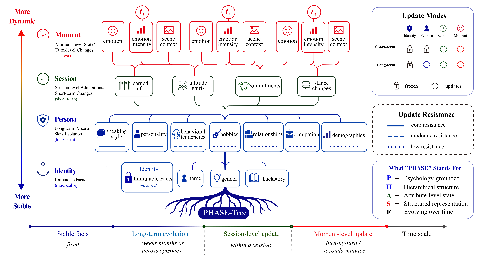
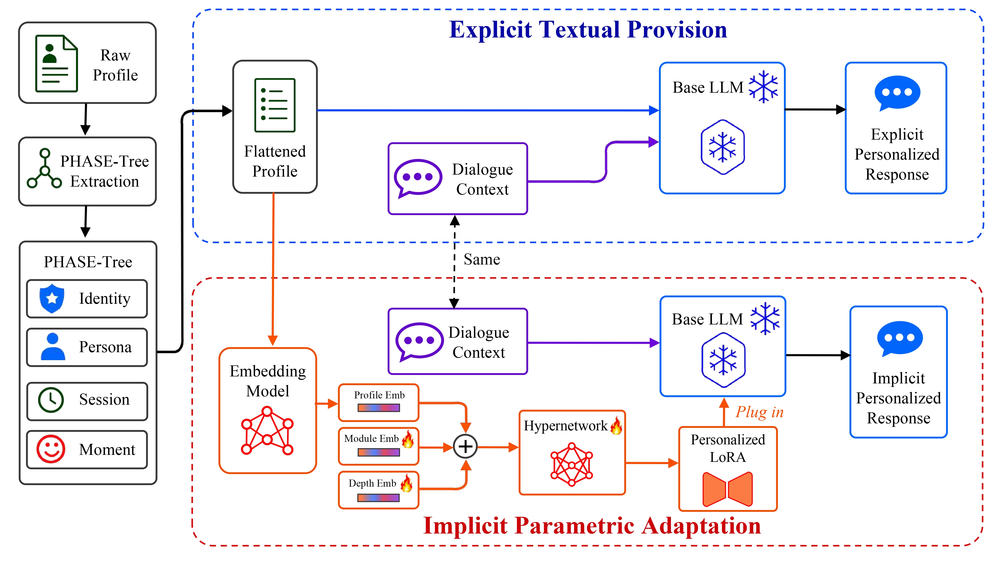
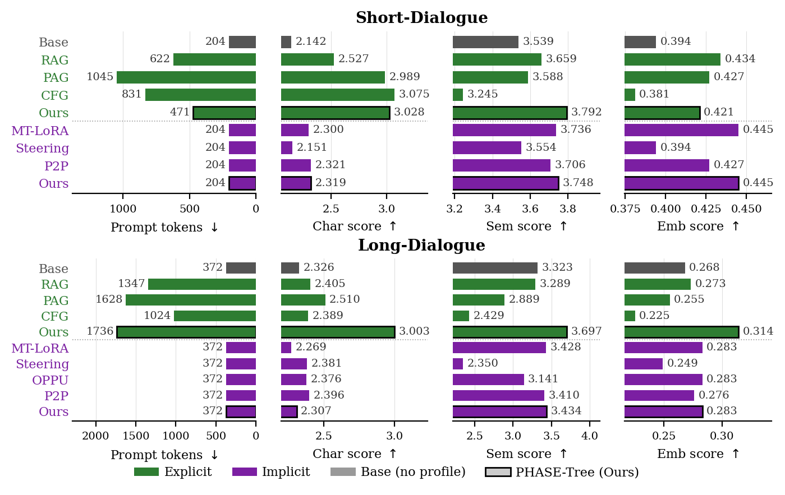

<div align="center">

# 🌳 PHASE-Tree
### 在长程角色扮演对话中建模角色状态的演化

[](https://arxiv.org/abs/2608.06975)
[](https://github.com/MemTensor/PHASE-Tree)
[](https://huggingface.co/datasets/IAAR-Shanghai/LongEvoRoleBench)
[](https://huggingface.co/IAAR-Shanghai/phase_tree_models)
[](https://huggingface.co/datasets/Mathematics-Yang/phase_tree_results)
[](LICENSE)

[**English**](README.md) | **中文**

<p>
  <em>一个心理学驱动、多时间尺度的角色状态表示——让角色扮演模型从角色<strong>当前的叙事状态</strong>出发回应，而不是被一个固定的人物档案锁死。</em>
</p>



<p><sub><b>图 1.</b> PHASE-Tree 将一个角色分解为<b>不可变身份</b>根节点 + 三个不同时间尺度的可变层：长期 <b>persona</b>（人格）、会话级 <b>session</b>（适应）、瞬时 <b>moment</b>（情绪/情境）。每个字段都是独立可寻址的更新目标，遵循<em>阻力</em>、<em>证据</em>、<em>冷却</em>三重门控。</sub></p>

</div>

---

## 📖 摘要

> 长程角色扮演要求角色在随故事演化的同时保持可辨识度。然而已有工作在两个方面存在不足：角色表示通常是静态档案，无法在不扰动其余未变特质的前提下做局部更新；评测基准则大多在测"人格保持"与"记忆召回"，而非检验模型能否从角色**当前演化后的状态**出发说话——我们把这种失败模式称为 **stale-state failure（陈旧状态失败）**。我们同时解决这两点。**PHASE-Tree** 是一棵多时间尺度的角色状态树，根节点是不可变身份，下面是可变的 `persona`、`session`、`moment` 三层，使每个可变字段都成为可独立寻址的更新目标，支持场景内与跨剧集的局部更新。它通过 **explicit textual provision**（把树序列化进 prompt）或 **implicit parametric adaptation**（把树编码进 LoRA 权重）两条路径条件生成。为衡量"演化后状态"的生成质量，我们提出 **LongEvoRoleBench**：在统一的下一句生成协议下，把 4 个长对话语料（跨剧集演化）与 4 个短对话语料（场景内状态跟踪检查）配对。在长对话核心上，textual PHASE-Tree 相对内部变体在 **12 个数据集–指标格子中拿下 11 个第一**，相对外部 textual baseline 则 **12 个格子全部第一**，将角色级、语义、embedding 分数分别提升 **19.7%**、**12.4%**、**15.1%**。在 200 条回复的盲评研究中，人类评分与 GPT-4.1 judge 相关（Pearson *r* = 0.65）；在描述性的 *n* = 10 PT 与 NR prompt 子集上，Overall 差值为 +0.20。长对话 Sem 优势在不同 LLM judge 与生成 backbone 下均保持。

## 🧭 速览

**PHASE-Tree**（*Psychology-grounded Hierarchical Attribute-Structured Evolving Tree*，心理学驱动的层次化属性结构演化树）由三部分组成：

1. **角色状态表示**：一棵四层角色状态树——不可变身份根节点 + 三个可编辑层（`persona / session / moment`）。每个字段都是独立可寻址的更新目标，支持场景内状态跟踪与跨剧集的人格演化（受 *阻力—证据—冷却* 三重门控约束）。
2. **两种条件生成范式**：同一份扁平化的 PHASE-Tree 通过两条互补路径驱动生成——**explicit textual provision**（把树序列化进 prompt，主验证路径，状态完全可检视）与 **implicit parametric adaptation**（用 profile-to-adapter 超网络编码为 LoRA 权重，token 高效的部署变体）。
3. **评测基准 — LongEvoRoleBench**：面向"长程角色状态演化"的评测套件，把 **8 个角色扮演语料库** 统一为下一句生成任务，含随机/OOD 切分、与状态对齐的指标、以及两种范式下的完整 baseline 分数。

<div align="center">

<p><sub><b>图 2.</b> 同一份扁平化的 PHASE-Tree 走两条条件生成范式——<b>Explicit Textual Provision</b>（上方蓝色）：角色档案放在 prompt 中，状态可被完全检视；<b>Implicit Parametric Adaptation</b>（下方红色）：角色档案被压缩到超网络生成的 LoRA 权重里，对话 prompt 不再携带档案，零额外 token 开销。</sub></p>
</div>

---

## 📰 动态

- **2026-08** &nbsp; 预印本已上线 arXiv：[arXiv:2608.06975](https://arxiv.org/abs/2608.06975)。如果这个代码库对你有帮助，请[引用这项工作](#-引用)。
- **2026-05** &nbsp; 代码、模型、数据、完整评测结果发布于 GitHub + Hugging Face。

---

## 🏆 主要结果

在 **LongEvoRoleBench**（backbone = `Qwen2.5-7B-Instruct`）上。下面统一用 **Ours (textual)** 和 **Ours (parametric)** 来区分两种条件生成范式——它们都是 PHASE-Tree，只是分别处在不同的 baseline 块里（论文 Table 1 = 内部消融，Table 2 = 外部对比，里面有两个 `Ours` 列并排）。

| 设置 | 结果 |
|------|------|
| 🏅 **内部消融（textual）** | PHASE-Tree 在全部 **24 个数据集–指标格子中拿下 21 个最佳**，在长对话核心的 **12 个格子中领先 11 个**。 |
| 📈 **外部 baseline（长对话宏平均, textual 块）** | **Ours (textual)** 在长对话 **12 个格子中全部第一**，相比该指标上最强的 textual-provision baseline 分别提升 **+0.49 Char（+19.7%）**（vs PAG）、**+0.41 Sem（+12.4%）**（vs RAG）、**+0.04 Emb（+15.1%）**（vs RAG）。 |
| 💸 **短对话 token 效率** | **Ours (textual)** 平均仅 **471** 个 prompt token，比 RP、RAG、PAG、CFG **小 24–55%**，同时 Sem 在这几者中最高。 |
| 🧩 **Parametric Adaptation** | **Ours (parametric)** 在零额外 profile-token 开销下，短对话 Sem 3.748 / 长对话 Sem 3.434 双双第一，长对话 Emb 0.283 并列第一。 |
| 🔬 **效应量** | 排序主要通过 paired Cohen's *d* 解读，而非只看 *p*（单格样本量可达约 1.6 × 10⁴）。长对话宏平均 *d*：PT vs. NR Sem 0.25 / Emb 0.26；PT vs. ST Sem 0.40 / Emb 0.30；Ours vs. MT-LoRA Char 0.72 / Sem 0.29 / Emb 0.19（临界）。 |

### 头号指标（长对话，4 个语料 × {random, OOD} 的宏平均）

| 范式 | 方法 | Char ↑ | Sem ↑ | Emb ↑ |
|---|---|:---:|:---:|:---:|
| —                       | Base（无 profile）         | 2.326 | 3.323 | 0.268 |
| Textual Provision       | RAG                        | 2.405 | 3.289 | 0.273 |
| Textual Provision       | PAG                        | 2.510 | 2.889 | 0.255 |
| Textual Provision       | CFG                        | 2.389 | 2.429 | 0.225 |
| Textual Provision       | **Ours (textual)**         | **3.004** | **3.697** | **0.314** |
| Parametric Adaptation   | MT-LoRA                    | 2.269 | 3.428 | 0.283 |
| Parametric Adaptation   | Activation Steering        | 2.381 | 2.350 | 0.249 |
| Parametric Adaptation   | OPPU                       | 2.376 | 3.141 | 0.283 |
| Parametric Adaptation   | P2P                        | 2.396 | 3.410 | 0.276 |
| Parametric Adaptation   | **Ours (parametric)**      | 2.306 | **3.434** | **0.283** |

> 加粗格子表示在所属范式块内的最佳。完整逐数据集结果见 [§ 复现论文](#-复现论文)。

### 成本 vs. 质量

<div align="center">

<p><sub><b>图 3.</b> Prompt token 开销（最左列条形图，越短越省）与 Char / Sem / Emb 指标的对照。短对话场景下 <b>Ours (textual)</b> 是所有"带 profile"方法里最省 token 的，同时 Sem 领先；长对话场景下 prompt 因要承载累积的演化历史而变长，但仍在 Sem 与 Emb 上取得对比中所有方法的最佳值。所有 parametric-adaptation 方法都收敛到 context-only 的 token 开销。</sub></p>
</div>

---

## 📁 仓库结构

```
PHASE-Tree/
├── preprocessing/         # 逐语料的角色档案抽取 + 对话格式化脚本
├── src/
│   ├── tree_pipeline/     # 构建 raw → static → dynamic → PHASE-Tree 档案
│   ├── hyper_llm_modulator/  # Hyper-LoRA 调制器（编码器、mixer、输出头）
│   ├── scripts/           # 超网络训练入口 + 启动脚本
│   └── configs/           # 训练 YAML
├── tasks/                 # 每个 split 的 metadata YAML（被 SFT 训练器消费）
├── evaluation/            # predict_* + judge.py + report.py + visualize.py
├── figures/               # 论文配图
├── .env                   # API key 占位模板——本地填入后再使用
├── requirements.txt       # 核心 Python 依赖
├── requirements-flash-attn.txt   # 可选的 FlashAttention-2（推荐安装）
└── LICENSE                # MIT
```

> ⚠️ 三个大目录**不**纳入 Git，需要从 Hugging Face 拉取：`LongEvoRoleBench/`、`phase_tree_models/`，以及（可选）`results/`。

---

## 🤗 发布的资源

| 类型     | 仓库 | Hugging Face | 默认本地路径 | 大约体积 |
|---------|------|--------------|--------------|----------|
| 数据集   | `IAAR-Shanghai/LongEvoRoleBench`        | [🤗 链接](https://huggingface.co/datasets/IAAR-Shanghai/LongEvoRoleBench) | `LongEvoRoleBench/`   | ≈ 9 GB |
| 模型     | `IAAR-Shanghai/phase_tree_models`      | [🤗 链接](https://huggingface.co/IAAR-Shanghai/phase_tree_models)       | `phase_tree_models/` | ≈ 1.8 GB |
| 评测结果 | `Mathematics-Yang/phase_tree_results`  | [🤗 链接](https://huggingface.co/datasets/Mathematics-Yang/phase_tree_results) | `results/`           | ≈ 9 GB |

**一键下载（在仓库根目录执行）：**

```bash
hf download IAAR-Shanghai/LongEvoRoleBench    --repo-type=dataset --local-dir LongEvoRoleBench
hf download IAAR-Shanghai/phase_tree_models                       --local-dir phase_tree_models
# 可选 —— 仅当你想跳过重新跑 prediction / judge 时下载：
hf download Mathematics-Yang/phase_tree_results --repo-type=dataset --local-dir results
```

你还需要把两个基座模型放到磁盘上（默认期望路径在 `models/` 下）：

```bash
hf download Qwen/Qwen2.5-7B-Instruct  --local-dir models/Qwen2.5-7B-Instruct
hf download Qwen/Qwen3-Embedding-4B   --local-dir models/Qwen3-Embedding-4B
```

---

## 🔧 安装

测试环境：**Python 3.10 + CUDA 12.x (Linux)**。Textual-provision 路径 1 张 A100/H100 即可；超网络 SFT 训练推荐 1 张 A100 80 GB。

```bash
git clone https://github.com/MemTensor/PHASE-Tree.git
cd PHASE-Tree

python -m venv .venv && source .venv/bin/activate

# 1) 核心依赖（torch、transformers、peft、vllm、openai ……）
pip install -r requirements.txt

# 2)（可选，推荐）FlashAttention-2 内核
#    必须在 requirements.txt 安装完成之后再装，并加 --no-build-isolation
pip install -r requirements-flash-attn.txt --no-build-isolation
```

如果你的环境无法构建 FlashAttention，代码会自动回退到 `attn_implementation="sdpa"`——吞吐略降，但训练和推理仍可正常运行。

> **PyTorch / CUDA 不匹配？** 先按 [官方选择器](https://pytorch.org/get-started/locally/) 装一份与本机驱动匹配的 PyTorch wheel，再装 `requirements.txt`。

---

## 🔑 API 配置

所有依赖 API 的步骤（角色档案抽取、人格演化、LLM-as-Judge、Embedding 相似度）都通过 `python-dotenv` 从仓库根目录的 `.env` 读取凭据。仓库自带的 `.env` 是**占位符模板**：

```bash
# 方法 A —— 直接在 .env 里填，注意不要把真实 key 提交到仓库
$EDITOR .env

# 方法 B —— 保留 .env 作为公开模板，把真实 key 写到本地副本（推荐）
cp .env .env.local
$EDITOR .env.local         # `.env.local` 已被 git-ignore
```

三组环境变量可以指向同一个 OpenAI-兼容 endpoint，也可以分别配置（例如 OpenAI 跑 judge + 本地 vLLM 跑 embedding）：

| 变量组      | 被谁使用 |
|------------|---------|
| `LLM_*`    | `preprocessing/*.py`、`src/tree_pipeline/*.py`（档案抽取 + 人格演化） |
| `JUDGE_*`  | `evaluation/judge.py`（LLM-as-Judge：Char + Sem） |
| `EMBED_*`  | `evaluation/judge.py`（预测 vs 参考的 cosine 相似度） |

---

## 🚀 快速上手

在一个短对话数据集上跑完整端到端流程（两条部署路径都走一遍）：

```bash
# 0) 拉数据 + 检查点（只需一次）
hf download IAAR-Shanghai/LongEvoRoleBench   --repo-type=dataset --local-dir LongEvoRoleBench
hf download IAAR-Shanghai/phase_tree_models                       --local-dir phase_tree_models

# 1) Textual provision：在 RAIDEN 上跑 predict + judge + report（两个 split）
bash evaluation/run_prompt_eval.sh RAIDEN

# 2) Parametric adaptation（超网络 → LoRA）：在 RAIDEN 上跑 predict + judge + report
bash evaluation/run_phase_tree_eval.sh RAIDEN

# 3) 一个外部 baseline（例如 RAG）作为对照
bash evaluation/run_comparison_eval.sh RAIDEN rag
```

每个启动脚本会读取 `LongEvoRoleBench/processed/<DATASET>/<METHOD>/{random_test,ood_test}.json`，把预测写到 `results/<DATASET>/<paradigm>/main/<METHOD>/<SPLIT>/predictions.jsonl`，然后依次串起来 `judge.py → report.py → visualize.py`。

---

## 🧬 Pipeline

PHASE-Tree 是一个 4 阶段的流水线，每个阶段都可以独立运行。我们已经把第 1、2 阶段的产出（在 `LongEvoRoleBench/`）和第 3 阶段的产出（在 `phase_tree_models/`）打包好了，你可以从任意一个阶段插入。

### Stage 1 · 逐语料预处理

`preprocessing/` 下每个源语料都对应一对脚本：**档案抽取** + **对话转换**。产物写到 `LongEvoRoleBench/processed/<Dataset>/intermediate/`。

```bash
# 以 Friends（长对话）为例：从第 1 季对白播种初始角色档案
python preprocessing/extract_profiles_friends.py

# 把 1–10 季的剧本转成"下一句生成"任务并做时序切分
python preprocessing/preprocess_dialogues_friends.py
```

短对话语料（`RAIDEN`、`CharacterEval`、`SimsConv`、`ChatHaruhi`）用人格聚类切分；长对话语料（`Friends`、`HPD`、`StarTrek_TNG`、`TheOffice`）用按时间顺序的 train / OOD-temporal 切分。

### Stage 2 · 构建 PHASE-Tree 的 6 个档案变体

消融链的 6 个档案变体放在 `LongEvoRoleBench/processed/<Dataset>/` 下：

| 变体               | 含义                                                     | 论文标签 |
|--------------------|----------------------------------------------------------|----------|
| `m1_context_only`  | 不带 profile —— 仅有对话上下文。                          | Base     |
| `m2_raw_profile`   | 原始抽取的档案文本。                                       | RP       |
| `m3_naive_rewrite` | 用 LLM 改写过的档案，无结构。                              | NR       |
| `m4_static_tree`   | 扁平化 PHASE-Tree，仅含 identity + persona。              | ST       |
| `m5_dynamic_tree`  | 跨剧集演化、但只演化 persona（仅长对话）。                  | DT       |
| `m6_phase_tree`    | **完整 PHASE-Tree**：identity + 演化 persona + session + moment。 | **PT（本文）** |

长对话的演化编排器（`pipeline_evolve_full`）会顺序执行：Stage A 证据累积 → Stage B 阻力门控更新 → Stage C 确定性后处理 patches：

```bash
# 全流程（LLM 演化 + 所有 patch）
python -m src.tree_pipeline.pipeline_evolve_full --dataset Friends

# 只跑 patches（跳过昂贵的 LLM 演化步骤）
python -m src.tree_pipeline.pipeline_evolve_full --dataset Friends --skip_evolve

# 把参数转给内部演化脚本（并行度、单集测试 ……）
python -m src.tree_pipeline.pipeline_evolve_full --dataset Friends --workers 8 --test_episode S05E10
```

单个子步骤（`evolve_persona`、`decay_stale_romantic`、`repair_inter_main_reciprocity`、`align_inverse_pair`、`forward_fill_continuity` ……）也可独立运行，详见 `pipeline_evolve_full.py` 顶部 docstring。

### Stage 3 · 超网络训练（Implicit Parametric Adaptation 路径）

Hyper-LoRA 调制器是一个把"角色档案 → 适配器权重"的超网络，包在 `Qwen2.5-7B-Instruct` 外面。我们提供的启动脚本会以 **warm-start** 的方式在 8 个 PHASE-Tree 训练集上做 SFT：

```bash
# 用发布的预训练 hypermod 做 warm-start（默认 INIT_CKPT）
bash src/scripts/train_phase_tree_qwen_7b.sh

# 从零训（不 warm-start）
INIT_CKPT="" bash src/scripts/train_phase_tree_qwen_7b.sh

# 覆盖超参
LR=1e-5 EPOCHS=20000 WARMUP=0.1 bash src/scripts/train_phase_tree_qwen_7b.sh
```

默认配置在 `src/configs/phase_tree_hyper_lora.yaml`（lr 5e-6、warmup 0.05、40 000 步、hierarchical batch sampler、sqrt-size mixture）。Checkpoint 会写到 `phase_tree_models/sft/<run>/{hypermod.pt, args.yaml, adapter_config.json}`，可被推理时的同一套 checkpoint reader 加载。

### Stage 4 · 推理

| 范式 | 脚本 | 作用 |
|------|------|------|
| Textual Provision — **Ours (textual)**     | `evaluation/predict_prompt.py`     | 把 PHASE-Tree 序列化进 prompt；vLLM 或 HF 后端均可。 |
| Parametric Adaptation — **Ours (parametric)** | `evaluation/predict_phase_tree.py` | 用 PHASE-Tree SFT hypermod 生成角色级 LoRA；*profile 不进 prompt*。 |
| Parametric Adaptation — P2P（baseline）        | `evaluation/predict_hypernet.py`   | 同样架构，但用原始档案训练的 P2P hypermod。 |
| 外部 baseline：RAG / PAG / CFG / Steering / MT-LoRA / OPPU | `evaluation/predict_{rag,cfg,steering,mt_lora,oppu}.py`（PAG 复用 `predict_rag.py` + `--profile_data`） | 两种范式各 3 个对照方法。 |

推荐用法是各范式自带的**启动脚本**——它会自动判断短对话/长对话、把任务分发到多 GPU，并依次跑 `predict → judge → report → visualize`：

```bash
# Textual Provision —— 消融链（短对话 m1+m2+m3+m4+m6；长对话再加 m5）
bash evaluation/run_prompt_eval.sh <DATASET>

# Parametric Adaptation —— PHASE-Tree SFT hypermod，所有方法、两个 split、多 GPU
bash evaluation/run_phase_tree_eval.sh                       # 全部 8 个数据集
bash evaluation/run_phase_tree_eval.sh Friends long-term     # 单数据集，显式指定模式

# Parametric Adaptation —— P2P 预训练 baseline
bash evaluation/run_hypernet_p2p_eval.sh <DATASET>

# 外部 baseline
bash evaluation/run_comparison_eval.sh <DATASET> rag         # 也支持：pag, cfg, steering, mt_lora, oppu
```

### 评测指标

只要 `predictions.jsonl` 存在，`evaluation/judge.py` 就会写出两个评分文件（支持断点续跑）：

| 文件                       | 取值范围 | 测什么 |
|----------------------------|----------|--------|
| `judge_scores.jsonl`       | 1 – 5    | `character_score`（角色档案一致性）+ `semantic_score`（上下文连贯性）。GPT-4.1 LLM-as-Judge，rubric 见 `evaluation/persona_rubric.md`。 |
| `embedding_scores.jsonl`   | [-1, 1]  | 用 `text-embedding-3-small` 算预测 vs. 参考的 cosine 相似度。 |

汇总 + 可视化：

```bash
python evaluation/report.py    --results_dir results/RAIDEN/prompt/main --baseline m2_raw_profile --per_character
python evaluation/visualize.py --results_dir results/RAIDEN/prompt/main --format pdf
python evaluation/autoreport.py                                          # 跨数据集汇总
```

参考侧的一个消融（用 `m2_raw_profile` 而不是完整 PHASE-Tree 作为 judge 的角色参考重新评分）见 `evaluation/run_ablation.sh`。

---

## 📊 数据集 · LongEvoRoleBench

八个角色扮演语料库被统一标准化为下一句生成任务，每个数据集都带有**随机**与 **OOD** 两个 test 切分：

| 数据集        | 语言   | 流水线类型 | 主要角色数 | OOD 维度 |
|---------------|--------|-----------|:----------:|----------|
| CharacterEval | 中文   | 短对话     | 77 | 未见角色聚类 |
| ChatHaruhi    | 中+英  | 短对话     | 31 | 未见角色聚类 |
| RAIDEN        | 中文   | 短对话     | 30 | 未见角色聚类 |
| SimsConv      | 英文   | 短对话     | 68 | 未见角色聚类 |
| Friends       | 英文   | 长对话     |  6 | 后期季的时序留出 |
| HPD（Harry Potter Dialogue）| 英文 | 长对话 | 6 | 后期书的时序留出 |
| StarTrek_TNG  | 英文   | 长对话     |  6 | 后期季的时序留出 |
| TheOffice     | 英文   | 长对话     |  6 | 后期季的时序留出 |

每个 `tasks/<name>/metadata.yaml` 都会向超网络 SFT 训练器注册一个 split；同一份 JSON 也直接被预测脚本消费。生成与评分都基于同一时刻 `t` 的角色状态，所以 Character Score 衡量的是"当前状态"，而不是"冻结的初始档案"。

---

## 🧪 复现论文

复现论文中每一个数字：

```bash
# 0) 准备好数据 + 推荐的 SFT 检查点
hf download IAAR-Shanghai/LongEvoRoleBench   --repo-type=dataset --local-dir LongEvoRoleBench
hf download IAAR-Shanghai/phase_tree_models                       --local-dir phase_tree_models

# 1) 在 8 个语料上跑所有 textual-provision 消融
for D in RAIDEN CharacterEval HPD SimsConv ChatHaruhi Friends StarTrek_TNG TheOffice; do
    bash evaluation/run_prompt_eval.sh "$D"
done

# 2) 所有 parametric-adaptation 消融
bash evaluation/run_phase_tree_eval.sh        # PHASE-Tree SFT hypermod —— Ours (parametric)
bash evaluation/run_hypernet_p2p_eval.sh      # P2P baseline

# 3) 外部 baseline（RAG、PAG、CFG、Steering、MT-LoRA、OPPU）
for D in RAIDEN CharacterEval HPD SimsConv ChatHaruhi Friends StarTrek_TNG TheOffice; do
    for M in rag pag cfg steering mt_lora oppu; do
        bash evaluation/run_comparison_eval.sh "$D" "$M"
    done
done

# 4) 一键汇总成论文风格的总表
bash evaluation/run_autoreport.sh
```

Token-pareto 图（论文 Fig. 3）由 `evaluation/make_token_figures.py` 生成，前提是各 `results/<DATASET>/<paradigm>/main/` 下已有 `summary.json`。

如果你只想看我们报告的数字，可以直接下载预计算结果包：

```bash
hf download Mathematics-Yang/phase_tree_results --repo-type=dataset --local-dir results
bash evaluation/run_autoreport.sh
```

---

## 🔁 Backbone 与 Judge 泛化性

> 附录级别的鲁棒性验证。每个数值都是在 **4 个短对话**（RAIDEN、CharacterEval、SimsConv、ChatHaruhi）或 **4 个长对话**（Friends、The Office、Harry Potter、Star Trek）语料 × {random, OOD} 上的宏平均，方案为 explicit textual provision 对比——Base / RAG / PAG / CFG / **Ours**（PHASE-Tree）。**加粗** = 该行最佳。

### 跨生成 backbone

协议不变，只替换生成 backbone（GPT-4.1 judge，固定 25% 子样本）。PHASE-Tree 的收益不依赖单一模型——从 0.6B 到 32B，它在**每一个长对话格子上都最优**。

**Character Score（Char ↑）**

| Backbone | 切分 | Base | RAG | PAG | CFG | Ours |
|----------|------|:----:|:---:|:---:|:---:|:----:|
| Qwen2.5-7B（主）  | Short | 2.183 | 2.533 | 3.038 | **3.096** | 3.044 |
| Qwen2.5-7B（主）  | Long  | 2.327 | 2.400 | 2.505 | 2.400 | **2.999** |
| Qwen3-0.6B        | Short | 1.642 | 1.681 | 1.970 | **2.038** | 1.850 |
| Qwen3-0.6B        | Long  | 1.904 | 1.831 | 1.906 | 1.711 | **2.029** |
| Gemma-4-E4B-it    | Short | 1.949 | 2.315 | 3.049 | 3.130 | **3.142** |
| Gemma-4-E4B-it    | Long  | 2.038 | 2.142 | 2.495 | 2.698 | **3.019** |
| Qwen3-32B         | Short | 3.197 | 3.356 | 3.815 | 3.797 | **3.986** |
| Qwen3-32B         | Long  | 2.930 | 2.976 | 3.208 | 3.101 | **3.685** |

**Semantic Score（Sem ↑）**

| Backbone | 切分 | Base | RAG | PAG | CFG | Ours |
|----------|------|:----:|:---:|:---:|:---:|:----:|
| Qwen2.5-7B（主）  | Short | 3.571 | 3.656 | 3.580 | 3.273 | **3.785** |
| Qwen2.5-7B（主）  | Long  | 3.327 | 3.285 | 2.883 | 2.444 | **3.707** |
| Qwen3-0.6B        | Short | 2.625 | 2.561 | 2.596 | 2.254 | **2.744** |
| Qwen3-0.6B        | Long  | 2.861 | 2.511 | 2.481 | 1.917 | **2.924** |
| Gemma-4-E4B-it    | Short | 3.402 | 3.525 | 3.416 | 3.075 | **3.619** |
| Gemma-4-E4B-it    | Long  | 3.256 | 3.270 | 2.911 | 2.774 | **3.715** |
| Qwen3-32B         | Short | 3.983 | 4.004 | 3.910 | 3.622 | **4.120** |
| Qwen3-32B         | Long  | 3.632 | 3.594 | 3.412 | 3.045 | **4.056** |

### 跨 judge 模型

用三个 LLM-as-Judge 后端（通过 `.env` 的 `JUDGE_*` 配置）对**同一份** `Qwen2.5-7B-Instruct` 预测重新打分。不同 judge 的绝对分数尺度不同（GLM-5.2 与 DeepSeek-V4-Flash 比 GPT-4.1 更严格），但排序稳定——**无论用哪个 judge，Ours 在每一个长对话格子上都领先**。

**Character Score（Char ↑）**

| Judge | 切分 | Base | RAG | PAG | CFG | Ours |
|-------|------|:----:|:---:|:---:|:---:|:----:|
| GPT-4.1（默认）    | Short | 2.143 | 2.527 | 2.989 | **3.075** | 3.028 |
| GPT-4.1（默认）    | Long  | 2.326 | 2.405 | 2.510 | 2.389 | **3.004** |
| GLM-5.2            | Short | 2.347 | 2.656 | 3.165 | **3.208** | 3.150 |
| GLM-5.2            | Long  | 2.607 | 2.665 | 2.709 | 2.524 | **3.040** |
| DeepSeek-V4-Flash  | Short | 2.675 | 2.893 | 3.040 | 2.819 | **3.210** |
| DeepSeek-V4-Flash  | Long  | 2.911 | 2.924 | 2.645 | 2.278 | **3.391** |

**Semantic Score（Sem ↑）**

| Judge | 切分 | Base | RAG | PAG | CFG | Ours |
|-------|------|:----:|:---:|:---:|:---:|:----:|
| GPT-4.1（默认）    | Short | 3.539 | 3.659 | 3.588 | 3.245 | **3.792** |
| GPT-4.1（默认）    | Long  | 3.323 | 3.289 | 2.889 | 2.429 | **3.697** |
| GLM-5.2            | Short | 2.824 | 2.913 | 2.853 | 2.583 | **3.025** |
| GLM-5.2            | Long  | 2.502 | 2.466 | 2.187 | 1.882 | **2.751** |
| DeepSeek-V4-Flash  | Short | 2.707 | 2.813 | 2.712 | 2.387 | **2.895** |
| DeepSeek-V4-Flash  | Long  | 2.611 | 2.583 | 2.238 | 1.892 | **2.917** |

---

## 📌 引用

```bibtex
@article{tang2026phasetree,
  title         = {PHASE-Tree: Modeling Character-State Evolution in Long-Horizon Role-Playing Dialogue},
  author        = {Tang, Bo and Yang, Jianan and Zhu, Junyi and Wu, Yiquan and Zhao, Rui and Yang, Zhengyu and Zhang, Yang and Xiong, Feiyu and Li, Zhiyu and Shen, Jiajun},
  journal       = {arXiv preprint arXiv:2608.06975},
  year          = {2026},
  eprint        = {2608.06975},
  archivePrefix = {arXiv},
  primaryClass  = {cs.CL},
  doi           = {10.48550/arXiv.2608.06975},
  url           = {https://arxiv.org/abs/2608.06975}
}
```

GitHub 页面右侧的 *Cite this repository* 按钮读取的是 [`CITATION.cff`](CITATION.cff)，解析结果与上面这条一致。

---

## 🙏 致谢

Hyper-LoRA 调制器架构基于 P2P 代码库 \[[Tan et al., 2025](https://arxiv.org/abs/2501.04652)\]。八个评测语料来自此前的公开发布——RAIDEN、CharacterEval、SimsConv、ChatHaruhi、HPD、[ConvoKit Friends Corpus](https://convokit.cornell.edu/documentation/friends.html)、以及 The Office 与 Star Trek: TNG 的公开剧本——感谢原始作者与维护者把这些资源开放出来。生成 backbone（`Qwen2.5-7B-Instruct`）和 embedding 编码器（`Qwen3-Embedding-4B`）来自 [Qwen 团队](https://github.com/QwenLM)。

---

## 📄 许可证

- 本仓库的**代码**采用 [MIT License](LICENSE) 发布。
- 发布在 Hugging Face 上的**模型检查点**与**评测结果**采用 **CC-BY-NC-4.0** —— 详见各自 Hugging Face 页面的 model / dataset card。
- 底层**对话语料**保留各自的原始许可证；二次分发请参阅各源数据集的条款。

---

<div align="center">
<sub>⭐ 如果这份工作对你有帮助，欢迎 Star——这能帮助更多人发现它。</sub>
</div>
